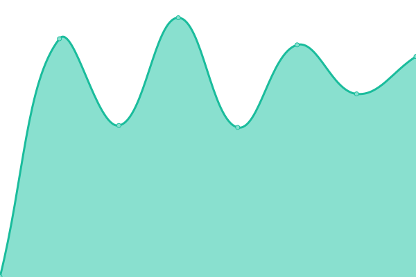
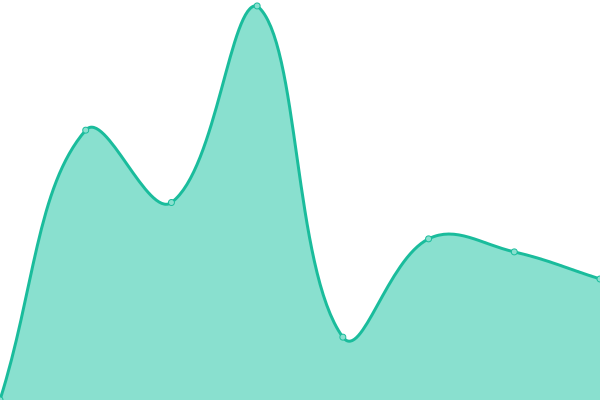

# [📈 Live Status](https://casman300.github.io/my_website_upptimes): <!--live status--> **🟩 All systems operational**

This repository contains the open-source uptime monitor and status page for [Charlie Seaman](http://www.casman.co.uk), powered by [Upptime](https://github.com/upptime/upptime).

With [Upptime](https://upptime.js.org), you can get your own unlimited and free uptime monitor and status page, powered entirely by a GitHub repository. We use [Issues](https://github.com/casman300/my_website_upptimes/issues) as incident reports, [Actions](https://github.com/casman300/my_website_upptimes/actions) as uptime monitors, and [Pages](https://casman300.github.io/my_website_upptimes) for the status page.

<!--start: status pages-->
<!-- This summary is generated by Upptime (https://github.com/upptime/upptime) -->
<!-- Do not edit this manually, your changes will be overwritten -->
<!-- prettier-ignore -->
| URL | Status | History | Response Time | Uptime |
| --- | ------ | ------- | ------------- | ------ |
|  [My Homepage](https://casman.co.uk) | 🟩 Up | [my-homepage.yml](https://github.com/casman300/my_website_upptimes/commits/HEAD/history/my-homepage.yml) | 

 888ms
     
 | 

<a href="https://casman300.github.io/my_website_upptimes/history/my-homepage">100.00%</a>
    

|  [Scouts Main Site](https://12hs.org.uk) | 🟩 Up | [scouts-main-site.yml](https://github.com/casman300/my_website_upptimes/commits/HEAD/history/scouts-main-site.yml) | 

 959ms
     
 | 

<a href="https://casman300.github.io/my_website_upptimes/history/scouts-main-site">100.00%</a>
    

|  [Baked Bean](https://baked-bean.co.uk) | 🟩 Up | [baked-bean.yml](https://github.com/casman300/my_website_upptimes/commits/HEAD/history/baked-bean.yml) | 

 979ms
     
 | 

<a href="https://casman300.github.io/my_website_upptimes/history/baked-bean">100.00%</a>
    

|  [6xTask](https://6xtask.co.uk) | 🟩 Up | [6x-task.yml](https://github.com/casman300/my_website_upptimes/commits/HEAD/history/6x-task.yml) | 

 1612ms
     
 | 

<a href="https://casman300.github.io/my_website_upptimes/history/6x-task">98.36%</a>
    

|  [Workshop Mayhem](https://www.workshopmayhem.co.uk) | 🟩 Up | [workshop-mayhem.yml](https://github.com/casman300/my_website_upptimes/commits/HEAD/history/workshop-mayhem.yml) | 

 1624ms
     
 | 

<a href="https://casman300.github.io/my_website_upptimes/history/workshop-mayhem">100.00%</a>
    

<!--end: status pages-->

[**Visit our status website →**](https://casman300.github.io/my_website_upptimes)

## 📄 License

- Powered by: [Upptime](https://github.com/upptime/upptime)
- Code: [MIT](./LICENSE) © [Charlie Seaman](http://www.casman.co.uk)
- Data in the `./history` directory: [Open Database License](https://opendatacommons.org/licenses/odbl/1-0/)
